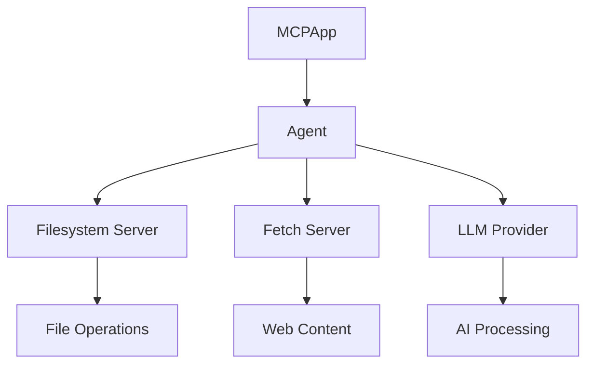

# Understanding the MCP Basic Agent

## What is MCP (Model Context Protocol)?

The Model Context Protocol (MCP) is a framework designed to standardize interactions between AI models and external tools or services. It provides a structured way for AI models to:
1. Access file systems
2. Fetch web content
3. Execute commands
4. Interact with various APIs and services

Think of MCP as a bridge between AI models and the real world, providing a standardized way to interact with external resources while maintaining security and control.

## What is an MCP Agent?

An MCP Agent is a Python-based implementation that:
1. Connects to MCP servers (like filesystem or fetch servers)
2. Manages communication between AI models and these servers
3. Handles authentication and security
4. Processes requests and responses
5. Manages the lifecycle of connections

The agent acts as a coordinator between:
- The AI model (in our case, GPT-4)
- The MCP servers (filesystem, fetch, etc.)
- The configuration system
- The logging system

## The Basic Agent's Purpose

The Basic Agent (`mcp_basic_agent`) serves as an introductory example of how to:
1. Set up an MCP agent
2. Connect to MCP servers
3. Use different LLM providers (OpenAI, Anthropic)
4. Handle file operations
5. Fetch web content
6. Manage configurations

It's designed to demonstrate the core functionality of the MCP framework without adding complex business logic.

## Key Components and Architecture

### 1. Core Components

#### MCPApp
- The main application container
- Manages the lifecycle of the agent
- Handles configuration loading
- Sets up logging

#### Agent
- Represents an individual agent instance
- Connects to specified MCP servers
- Manages tool discovery and usage
- Handles LLM integration

#### MCP Servers
- **Filesystem Server**: Provides secure access to specified directories
- **Fetch Server**: Handles web content retrieval
- Each server provides a set of tools that the agent can use

### 2. Architecture Flow



### 3. Configuration System

The agent uses a layered configuration approach:
1. **Base Configuration**: Default settings in code
2. **Config File**: `mcp_agent.config.yaml` for server settings
3. **Environment Variables**: API keys and sensitive data in `.env`

### 4. Security Model

The Basic Agent implements several security features:
1. Restricted filesystem access to specified directories
2. Environment variable protection for sensitive data
3. Controlled server access through configuration
4. Tool-level permission management

## Real-World Usage Examples

### 1. File Operations Scenario

Let's say you want to:
1. Find all Python files in a directory
2. Read their contents
3. Check for specific imports

Here's how MCP handles this:

```python
# User request: "Find all Python files and check for tensorflow imports"

# Behind the scenes, MCP:
1. Uses filesystem-search_files to find .py files
2. Uses filesystem-read_file on each file
3. Analyzes content for "import tensorflow"
4. Returns formatted results
```

### 2. Web Content Processing

Scenario: You need to:
1. Fetch a webpage
2. Extract specific information
3. Save it to a file

MCP handles this through:
```python
# User request: "Get Python documentation and save important parts"

# MCP Process:
1. fetch-fetch gets the webpage
2. LLM processes content for relevance
3. filesystem-write_file saves results
```

## Understanding the Tool System

The MCP Basic Agent uses a tool-based architecture. Think of it like a Swiss Army knife:

### 1. Filesystem Tools
```json
{
    "name": "filesystem-read_file",
    "description": "Read file contents",
    "inputs": {
        "path": "file path to read"
    }
}
```
- Like having a file reader tool in your knife

### 2. Fetch Tools
```json
{
    "name": "fetch-fetch",
    "description": "Get web content",
    "inputs": {
        "url": "webpage to fetch",
        "max_length": "content limit"
    }
}
```
- Like having a web browser tool

### 3. Tool Discovery
The agent can:
- List available tools
- Understand their purposes
- Choose the right tool for each task
- Handle tool limitations

## How the LLM Integration Works

The LLM (GPT-4) acts as the brain:

1. **Request Processing**
   ```python
   "List Python files in /project"
   ↓
   LLM understands: Need to use filesystem-search_files
   ```

2. **Tool Selection**
   ```python
   LLM chooses:
   filesystem-search_files with {"pattern": "*.py"}
   ```

3. **Result Processing**
   ```python
   Raw result: ["/project/main.py", "/project/utils.py"]
   ↓
   LLM formats: "Found 2 Python files: main.py and utils.py"
   ```

## Security Model in Practice

### 1. Filesystem Security

```python
# Allowed:
"Read file in C:/Users/kevin/ClaudeMCPFolder/config.txt"
✓ Path is in allowed directories

# Blocked:
"Read file in C:/Windows/system32/config.txt"
✗ Path not in allowed directories
```

### 2. Web Security

```python
# Allowed:
"Fetch https://python.org"
✓ Valid HTTPS URL

# Blocked:
"Fetch file:///C:/Windows/system32/config"
✗ Protocol not allowed
```

## Common Use Cases and Solutions

### 1. File Management
```python
# Finding specific files
"Find all JSON files modified today"
→ Uses search_files with pattern and date filter

# Bulk operations
"Update version in all package.json files"
→ Combines search_files and edit_file
```

### 2. Content Processing
```python
# Web scraping
"Get Python news from official blog"
→ Uses fetch + LLM processing

# File analysis
"Find TODO comments in code"
→ Uses search_files + read_file + LLM analysis
```

### 3. Combined Operations
```python
# Documentation generation
"Create docs from Python files"
→ Uses:
1. search_files for .py files
2. read_file for contents
3. LLM for doc generation
4. write_file for saving
```

## Troubleshooting Guide

### 1. Connection Issues
```
Error: "Failed to connect to filesystem server"
↓
Check:
1. Node.js installation
2. Server path in config
3. Directory permissions
```

### 2. Permission Issues
```
Error: "Path not allowed"
↓
Check:
1. Allowed directories in config
2. File paths being accessed
3. Server configuration
```

### 3. LLM Issues
```
Error: "OpenAI API error"
↓
Check:
1. API key in .env
2. Network connection
3. Rate limits
```

## Next Steps

Now that you understand the basic concepts, proceed to the [Code Walkthrough](./code_walkthrough.md) for a detailed explanation of the implementation.
