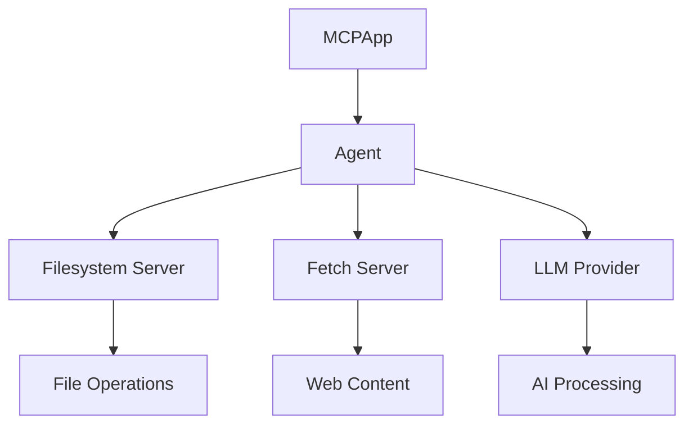

# Understanding the MCP Basic Agent

## What is MCP (Model Context Protocol)?

The Model Context Protocol (MCP) is a framework designed to standardize interactions between AI models and external tools or services. It provides a structured way for AI models to:
1. Access file systems
2. Fetch web content
3. Execute commands
4. Interact with various APIs and services

Think of MCP as a bridge between AI models and the real world, providing a standardized way to interact with external resources while maintaining security and control.

## What is an MCP Agent?

An MCP Agent is a Python-based implementation that:
1. Connects to MCP servers (like filesystem or fetch servers)
2. Manages communication between AI models and these servers
3. Handles authentication and security
4. Processes requests and responses
5. Manages the lifecycle of connections

The agent acts as a coordinator between:
- The AI model (in our case, GPT-4)
- The MCP servers (filesystem, fetch, etc.)
- The configuration system
- The logging system

## The Basic Agent's Purpose

The Basic Agent (`mcp_basic_agent`) serves as an introductory example of how to:
1. Set up an MCP agent
2. Connect to MCP servers
3. Use different LLM providers (OpenAI, Anthropic)
4. Handle file operations
5. Fetch web content
6. Manage configurations

It's designed to demonstrate the core functionality of the MCP framework without adding complex business logic.

## Key Components and Architecture

### 1. Core Components

#### MCPApp
- The main application container
- Manages the lifecycle of the agent
- Handles configuration loading
- Sets up logging

#### Agent
- Represents an individual agent instance
- Connects to specified MCP servers
- Manages tool discovery and usage
- Handles LLM integration

#### MCP Servers
- **Filesystem Server**: Provides secure access to specified directories
- **Fetch Server**: Handles web content retrieval
- Each server provides a set of tools that the agent can use

### 2. Architecture Flow

### 3. Configuration System

The agent uses a layered configuration approach:
1. **Base Configuration**: Default settings in code
2. **Config File**: `mcp_agent.config.yaml` for server settings
3. **Environment Variables**: API keys and sensitive data in `.env`

### 4. Security Model

The Basic Agent implements several security features:
1. Restricted filesystem access to specified directories
2. Environment variable protection for sensitive data
3. Controlled server access through configuration
4. Tool-level permission management

## Next Steps

Now that you understand the basic concepts, proceed to the [Code Walkthrough](./code_walkthrough.md) for a detailed explanation of the implementation.
